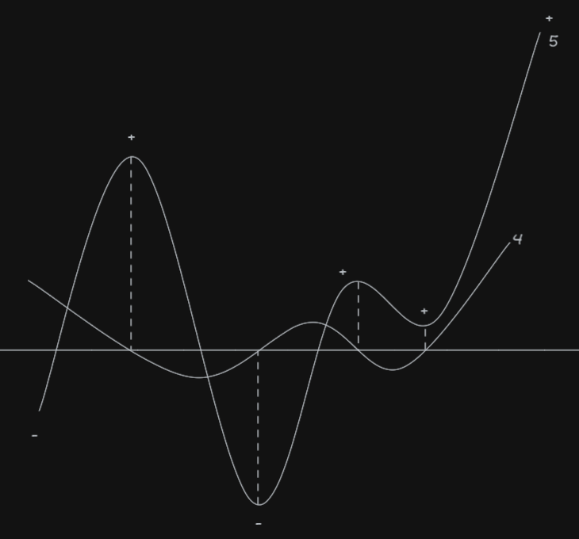

- Finding roots of a quintic function:
  $$y = a x^5 + b x^4 + c x^3 + d x ^2 + e x + f$$
	- {:height 450, :width 474}
	- Take quartic derivative:
	  $$y' = 5a x^4 + 4b x^3 + 3c x^2 + 2d x + e$$
	- Find its roots: $$x_1, x_2, x_3, x_4$$
	- Then find quintic roots between real roots of the quartic function and $$\pm \infty$$ where the quintic function has changed sign
		- Newton's method would work
			- Take the y-intercept of a line between $$(f(x_1), x_1)$$ and $$(f(x_2), x_2)$$ as an initial guess
		- Could RK methods be inverted to advance by $$dy$$ instead of $$dx$$?
			- Possibly, but Newton's is a lot simpler
		- Binary search would also work, but very slowly