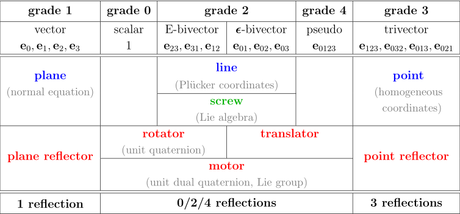

- [YouTube explanation]({{video https://www.youtube.com/watch?v=v-WG02ILMXA}})
- Bivector partitioning:
	- In PGA, one should be able to work without splitting at all
	- Euclidean split bivector: $B = \bold B + \bold {\epsilon v}$
		- $\bold B$ is a Euclidean bivector
		- $\bold v$ is a Euclidean vector
		- To be avoided, used to show correspondence with classical dynamics
	- Screw split bivector: $B = \omega L + \nu L I$
		- $L$ is a 2-blade meet line
		- $\omega \ge 0$
		- $\nu$ can have any sign
		- Valid only for 3D PGA
		- Weighted sum of a normalized meet line $L$ (so that $L^2 = -1$) and a directional part $LI$ (with $LI^2 = 0$)
		- When used in an exponential, the resulting motor $V$ can be factorized $V = e^B = e^{\omega L} e^{\nu LI}$
			- If B is a 2-blade, either $\omega$ or $\nu$ is zero
	- Point split at Q of dual bivector: $B_* = \bold p \cdot Q + \bold RI$
		- $Q = O + \bold q I$
		- $\bold R$ is a Euclidean bivector
		- Join lines represented by dual bivectors represent the (momentary) path of a motion
		- This point split is geometrical: its transformation by a motor $M$ is a similar split relative to the transformed point
		      $Q' = MQ \widetilde M$
		      $B_*' = M B_* \widetilde M = \bold p' \cdot Q' + \bold R' I$
- 
- The Motor Logarithm (ignoring the -1/2 factor)
	- $M = e^{B}$
	- $B = \log M$
- Geometrical Physics
	- 2.1 The Kinematics of Euclidean Motion
		- 2.1.1 Resolving a Differentiation Paradox
			- $M(t) = e^{-Bt/2} M_0$
				- where $M_0 = 1$
			- $\displaystyle \dot M(t) = -\frac B 2 e^{-Bt/2} = -\frac B 2 M$
			- $B = -2 \dot M \widetilde M$
				- This is the bivector of the motor in the *world-frame*
			- $\dot M = - \frac 1 2 M B'$
			- $B' = -2 \widetilde M \dot M$
				- This is the bivector of the motor in the *body-frame*
			- $B = M B' \widetilde M$
		- 2.1.2 The Bivector Velocity (or Rate) $B$
			- B is not constant in general
			- $M(t) = e^{-B(t) / 2} M_0$
			- Then the time derivative will involve $\frac d {dt} B(t)$
				- It is customary to denote this bivector velocity by $B$,
				- Note that $B$ has units (1 / time) since motors are dimensionless
			- Differentiating: $M \widetilde M = 1$
				- $\dot M \widetilde M + M \dot{\widetilde M} = 0$
				  $M \dot{\widetilde M} = - \dot M \widetilde M$
				  $\dot{\widetilde M} = - \widetilde M \dot M \widetilde M$
			- $\dot X(t) = \frac d {dt} X(t)$
			            $= \frac d {dt} (M X_0 \widetilde M)$
			            $= \dot M X_0 \widetilde M + M X_0 \dot{\widetilde M}$ (by the product rule)
			            $= \dot M X_0 \widetilde M - M X_0 (\widetilde M \dot M \widetilde M)$ (substitute for $\dot{\widetilde M}$)
			            $= (\dot M \widetilde M) M X_0 \widetilde M - M X_0 (\widetilde M \dot M \widetilde M)$ (insert $\widetilde M M= 1$)
			            $= (- \frac 1 2 B) (M X_0 \widetilde M) - (M X_0 \widetilde M) (- \frac 1 2 B)$
			            $= (- \frac 1 2 B) X(t) - X(t) (- \frac 1 2 B)$
			            $= X(t) \times B$
				- Where $\times$ is the commutator product:
				  $P \times Q = \frac 1 2 (PQ - QP)$
					- This looks like the exterior product for vectors (and it is)
				- Only for bivectors is grade preserved by the commutator product, therefore $B$ must be a bivector:
					- $B = -2 \dot M \widetilde M = 2 M \dot{\widetilde M} = 2 \widetilde{(\dot M \widetilde M)} = - \widetilde B$
			- Depending on the nature of $M$, its bivector $B$ can be a linear velocity, angular velocity, or a combination of both, so we call $B$ the *rate* of the motion
		- 2.1.3 World Frame and Object Frame Derivatives (world: ${}_w$, body: ${}_b$)
			- In the world frame with rate bivector $B_w = M B_b \widetilde M$:
			    $\dot M = - \frac 1 2 B_w M$
			- In the body frame with rate bivector $B_b = \widetilde M B_w M$:
			    $\dot M = - \frac 1 2 M B_b$
			- The derivative of a *constant* $X_0$ that was moved by a motor $M$ to become $X_w = M X_0 \widetilde M$ is:
			    $\dot X_w = X_w \times B_w$
			- If $X$ itself is moving, such as a time-dependent $X_b$, that moves to $X_w = M X_b \widetilde M$:
				- $\dot X_w = \frac{d}{dt} (M X_b \widetilde M)$
				         $= (M X_b \widetilde M)\times B_w + M \dot X_b \widetilde M$
				         $= X_w \times B_w + (\dot X_b)_w$
				- It is these extra terms that make the world frame less convenient than the body frame for dynamics
		- 2.1.4 Moving a PGA Point
			- $X = O + \bold x I$
			- $\dot X = \frac{d}{dt}(O + \bold x I) = \dot{\bold x} I = X \times B_w$
		- 2.1.5 Transferring Rates: Preserve Ideals
			- Ideal elements in the world frame are also part of the body frame
			- For a body moving with constant velocity $\bold v_w$
				- $\displaystyle M = e^{-\bold {\epsilon v}_w t / 2}$
				- $B_w = \bold {\epsilon v}_w$
				- $B_b = -2 \widetilde M \dot M = \widetilde M (\bold {\epsilon v}_w) M = ... = \bold{\epsilon v}_b$
				- $\bold v_b = M_0 \bold v_w \widetilde {M_0}$
	- 2.2 Moving Masses
		- 2.2.1 The Momentum of a Mass Point is a Line
			- Mass point:
			    $mX$
			- Velocity:
			    $\dot X = \dot{\bold x} I$
			- Momentum of mass point:
			    $P = mX \vee \dot X$
			         $= m X \vee (\dot{\bold x} I)$
			         $= m \dot{\bold x} \cdot X$
			- This is the momentum line that passes through point $X$
			- Seen from another point $Y$ at relative position $\bold r = \bold y - \bold x$:
				- $P = m \bold v \cdot X$
				       $= m \bold v \cdot Y + m \bold v \cdot (X - Y)$
				       $= m \bold v \cdot Y + m \bold v \cdot (\bold r I)$
				       $= m \bold v \cdot Y - (\bold r \wedge m \bold v) I$
				- The momentum $P$ automatically acquires the appropriate angular momentum when viewed from another point
				- If $Y$ happens to be along the line $\bold r \wedge \bold v = 0$, so there is a "gauge freedom" of sliding along the join line without affecting the value
		- 2.2.3 The Inertia Map
			- Total momentum for a point set subjected to motor $M(t) = e^{-B_w(t)/2}$, 
			  using $\dot X_i = X_i \times B_w$:
				- $P = \sum_i P_i$
				       $= \sum_i m_i X_i \vee \dot X_i$
				       $= \sum_i m_i X_i \vee (X_i \times B_w)$
				       $\equiv I_w[B_w]$
				- $I_w[B_w] \equiv \sum_i m_i X_i \vee (X_i \times B_w)$
			- When the mass distribution is continuous (a mass density), the sum is replaced by an integral
		- 2.2.4 Total Inertia Computed in the Body Frame
			- Instead of $I_w[B_w]$ as a function of $B_w$, we consider $\widetilde M I_w[B_w] M$ as a function of $B_b = \widetilde M B_w M$, denoted $I_b[]$
			- Total body inertia: $I_b[B_b] = \widetilde M I_w[M B_b \widetilde M] M$
			- (this section compares PGA inertia with classical vector inertia)
		- 2.2.5 PGA Body Inertia in the Eigenbasis
			- $\displaystyle I_b[B_b] = \underset {ij} \sum m[B_b]_{0k} \bold e_{ij} + \underset k \sum i_{ij} [B_b]_{ij} \bold e_{0k}$
			- $\displaystyle I_b^{-1}[B_b] = \underset {ij} \sum \frac 1 {i_{ij}}[B_b]_{0k} \bold e_{ij} + \underset k \sum \frac 1 m [B_b]_{ij} \bold e_{0k}$
		- 2.2.6 The Inertia Map Dualizes Bivectors
			- $P = I[B]$: The inertial duality map $I[]$ takes a bivector rate $B$ used to describe the kinematics of a motor and uses the mass distribution of the object to map it to a dual bivector $P$, representing a momentum that dynamical forces can act on
			- It thus couples dynamics and kinematics (forces and motions) via the lopsidedness of the mass distribution