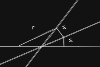

- Instead of lengths and angles, works with spreads and quadrances
- Quadrance: given points a and b:
	- $$Q(a, b) = (a - b)^2 = l^2$$
- Spread: given lines a and b: (of the form $$ax + by + c = 0$$)
  $$s(a, b) = \frac {(a \wedge b)^2}{a^2 b^2} = \left( {\frac {a \wedge b}{|a||b|}} \right) ^2 = \left( \hat a \wedge \hat b \right) ^2$$
  $$s(a, b) \in [0, 1] $$
	- Both angles at the intersection of two lines ($$\phi$$ and $$\pi - \phi$$) have the same spread
	- As in GA, $$a \wedge b = 0$$ indicates parallel lines and $$a \cdot b = 0$$ indicates perpendicularity
- Five Laws of Rational Trigonometry:
	- Triple Quad Formula:
		- Three points $$A_1, A_2, A_3$$ are collinear (they lie on a single line) when:
		  $$( Q_1 + Q_2 + Q_3 ) ^2 =  2(Q_1^2 + Q_2^2 + Q_3^2)$$
	- Pythagoras' Theorem:
		- The lines $$A_1 A_2$$ and $$A_2 A_3$$ are perpendicular when:
		  $$Q_1 + Q_2 = Q_3$$
	- Spread Law:
		- For any triangle $$\overline {A_1 A_2 A_3} $$ with non-zero quadrances:
		  $$\frac {s_1} {Q_1} = \frac {s_2}{Q_2} = \frac {s_3}{Q_3} $$
	- Cross Law:
		- For any triangle $$\overline {A_1 A_2 A_3} $$, define the cross $$c_3 = 1 - s_3$$:
		  $$\left( Q_1 + Q_2 + Q_3 \right)^2 = 4 Q_1 Q_2 c_3 = 4 Q_1 Q_2 (1 - s_3)$$
		- If $$s_3 = 0$$:
		  $$\left( Q_1 + Q_2 - Q_3 \right)^2 = 4 Q_1 Q_2$$
		- Alternatively, for lines $$a$$ and $$b$$:
		  $$c = \frac {(a \cdot b)^2}{a^2 b^2}$$
	- Triple Spread Formula:
		- For any triangle $$\overline {A_1 A_2 A_3}$$:
		  $$(s_1 + s_2 + s_3)^2 = 2 (s_1^2 + s_2^2 + s_3^2) + 4 s_1 s_2 s_3$$
		- $$(s_{sum} + s_3)^2 = 2 (s_{sum sqr} + s_3^2) + s_{four s_{23}} s_3$$
	- Spread polynomials:
	  $$r = S_2(s) = 4 s (1-s)$$
		- 
		- Similar to the logistic map of chaos theory
		- The polynomial $$S_n$$ is of degree n in s