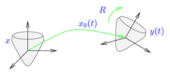

- Taken from Guide to Geometric Algebra in Practice, Chapter 1
- Kinematics
	- Start from a reference configuration, typically with the center of the body's mass at the origin
		- Describe the transformation from the reference configuration to the actual configuration
			- $y(t) = R(t) x \tilde{R}(t) + x_0(t)$
		- 
		- Differentiating:
			- $\dot y (t) = \dot R x \tilde R + R x \dot{\tilde R} + \dot x_0$
		- Since $R \tilde R = 1$, we have $\dot R \tilde R + R \dot{\tilde R} = 0$, and therefore $\dot R \tilde R = - R \dot{\tilde R}$
			- $\dot y (t) = \dot R (\tilde R R) x \tilde R + R x (\tilde R R) \dot{\tilde R} + \dot x_0$       (using $$\tilde R R = 1$$)
			          $= (\dot R \tilde R) R x \tilde R - R x \tilde R (\dot R \tilde R) + \dot x_0$       (using $$\dot R \tilde R = -R \dot {\tilde R} $$)
			          $= (R x \tilde R) \cdot \Omega + \dot x_0$
			- Where $\Omega = -2 \dot R \tilde R$ is the angular velocity bivector
		- Defining angular velocity in the reference frame   $\Omega_B = \tilde R \Omega R$
			- $\dot y(t) = R(x \cdot \Omega_B) \tilde R + v_0$
- Dynamics
	- Let $\rho (x)$ be the density of the body at x in the reference configuration
	- Let $y(x, t)$ and $v(x, t)$ be the corresponding spatial-configuration position and velocity
	- The angular momentum bivector:
		- $L(t) = \int d^3 x \rho(x) (y(x, t) - x_0) \wedge v(x, t)$
		           $= \int d^3 x \rho(x) (R x \tilde R) \wedge (R (x \cdot \Omega_B) \tilde R) + v_0)$
		           $= R \left( \int d^3 \rho(x) x \wedge (x \cdot \Omega_B) \right) \tilde R$
			- Where $v_0 = \dot x_0$ and the $v_0$ term disappears by the definition of the center of mass
	- From this we extract the inertia tensor:
		- $I(B) = \int d^3 x \rho (x) x \wedge (x \cdot B)$
		- $I(B)$ is a linear function mapping bivectors to bivectors
	- Angular momentum is obtained by rotating the body angular momentum to the space frame
		- $L = R I \Omega_B \tilde R$
	- Dynamic equation of motion is $\dot L = T$, where $T$ is the bivector torque in the spatial frame
		- I.e., force $f$ at location $y$ gives $T = (y - x_0) \wedge f$
		- $\dot L = \dot R I(\Omega_B) \tilde R + R I(\Omega_B) \dot{\tilde R} + R I (\dot \Omega_B) \tilde R = R \left[ I(\dot \Omega_B) - \Omega_B \times I(\Omega_B) \right] \tilde R$
	- Rotating back to the reference frame
		- $I(\dot \Omega_B) - \Omega_B \times I(\Omega_B) = \tilde R T R$
- Rigid Body Dynamics in 5D CGA
	- Positive square basis vectors $e_1$, $e_2$, $e_3$,
	  with two extra vectors adjoined $e$ and $\bar e$, satisfying $e^2 = +1$ and $\bar e^2 = -1$
	- From these, form null vectors $n = e + \bar e$ and $\bar n = e - \bar e$
	  which has the origin as $-\bar n / 2$
	- $X = \frac 1 {2\lambda^2} \left( \bold x^2 n_\infty + 2\lambda \bold x - \lambda^2 \bar n \right)$
		- Note: by setting $\lambda = 1$, we find that $n = n_\infty$ and $\bar n = -2 n_0$
			- $e = \frac 1 2 (n + \bar n) = -n_0 + \frac 1 2 n_\infty = -\sigma_+$
			- $\bar e = \frac 1 2 (n - \bar n) = n_0 + \frac 1 2 n_\infty = \sigma_-$
			- $\bar n \cdot n = 2$ corresponds to $n_0 \cdot n_\infty = -1$
		- $\bold x$ is the Euclidean position vector
		- $\lambda$ is a constant with dimension of length
		- $X$ is defined so that it is covariantly normalized since it satisfies $X \cdot n_\infty = -1$
	- The idea is to set up a Lagrangian which is covariant wrt the 5D geometry but for which the energy is just the ordinary 3D rigid body energy to get equations of motion which are correct at the 3D level but covariantly expressed in 5D
	- The current configuration of the rigid body is expressed by a combined rotation/translation rotor so that they are as integrated as possible
		- Any such rotor can be decomposed as $R(t) = R_1(t) R_2(t)$
		- page 7