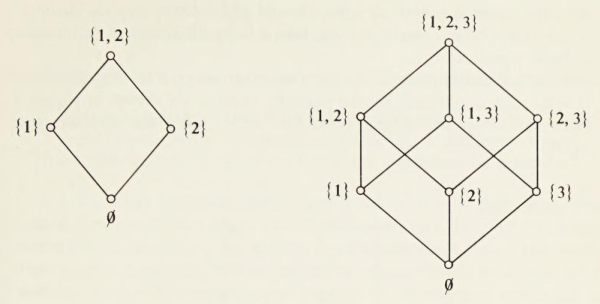

- 1.1 Inclusion
	- The empty/null set: $$\varnothing = \{\}$$
		- For any set: $$A \cap \varnothing = \varnothing$$
	- Element inclusion: $$x \in A$$ and $$x \notin B$$
	- Set inclusion/subset: $$A \subset B$$
		- Transitivity: if $$A \subset B$$ and $$B \subset C$$, then $$A \subset C$$
	- Set inclusion/superset: $$B \supset A$$
	- Set equality: $$A \subseteq B$$ and $$B \supseteq A$$
	- Set inequality: $$A \subsetneq B$$ and $$B \supsetneq A$$
- 1.2 Operations on Sets
	- Set intersection/meet: $$A \cap B$$
		- (1) Commutivity: $$A \cap B = B \cap A$$
		- (2) Associativity: $$(A \cap B) \cap C = A \cap (B \cap C)$$
		- (3) Inclusion: $$A \cap B = A$$ if and only if $$A \subset B$$
		- (4) For any $$A$$: $$A \cap \varnothing = \varnothing$$
		- (5) $$A \cap (B \cup C) = (A \cap B) \cup (A \cap C)$$
	- Set union: $$A \cup B$$
		- (1') Commutivity: $$A \cup B = B \cup A$$
		- (2') Associativity: $$(A \cup B) \cup C = A \cup (B \cup C)$$
		- (3') Inclusion: $$A \cup B = A$$ if and only if $$B \subset A$$
		- (4') For any $$A$$: $$A \cup \varnothing = A$$
		- (5') $$A \cup (B \cap C) = (A \cup B) \cap (A \cup C)$$
	- Complementation and the universal set $$U$$:
		- Define $$A'$$ as the complement of A
		- (6) $$(A')' = A$$
		- (7) $$A \cap A' = \varnothing$$ and $$A \cup A' = U$$
		- (8) $$(A \cap B)' = A' \cup B'$$
		- (9) $$(A \cup B)' = A' \cap B'$$
	- Subtraction:
		- Subtract two sets: $$A - B = A - (A \cup B)$$
		- Complement as subtraction: $$A' = U - A$$
	- Intersection of many sets: $$\underset i \cap A_i$$
	- Union of many sets: $$\underset i \cup A_i$$
	- Symmetric difference:
		- All elements in A xor B: $$A + B = (A - B) \cup (B - A)$$
	- Cofinite:
		- Set $$B \subset A$$ is cofinite if $$B' \cap A$$ is finite
		- If B and C are cofinite subsets of A, $$B \cap C$$ is also cofinite
- 1.3 Partially Ordered Sets and Lattices
	- A **chain** is a partially ordered set in which for any a and b, either $$a \le b$$ or $$b \le a$$
	- The set of all real numbers forms a chain
	- Power set $$P(A)$$: the set of all subsets of a fixed set $$A$$
		- If $$A = \{1, 2\}$$, then $$P(A) = \{ \varnothing, \{1\}, \{2\}, \{1, 2\} \}$$
		- 
			- ^ interesting analogue to blades in $$\mathcal G_{2,0}$$ and $$\mathcal G_{3,0}$$
	- **Upper bound**: let $$S$$ be a subset of a partially ordered set $$L$$
		- An element $$u \in L$$ is an *upper bound* of $$S$$ if $$s \le u$$ for all $$s \in S$$
		- Can use $$\infty$$ or $$-\infty$$ as upper and lower bounds, so every set has both
	- **Least upper bound**: $$u \le v$$ for any upper bound $$v$$ of $$S$$
		- Unique if it exists
	- **Lattice**: a partially ordered set in which every two elements have a greatest lower bound ($$a \cap b$$) and least upper bound ($$a \cup b$$)
		- The lattice $$L$$ is complete if any subset of $$L$$ has a least upper bound and a greatest lower bound